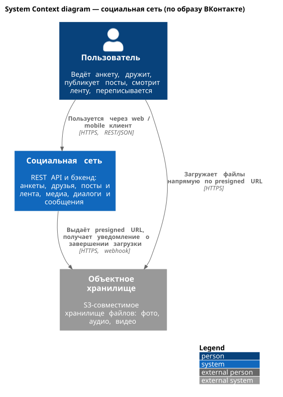
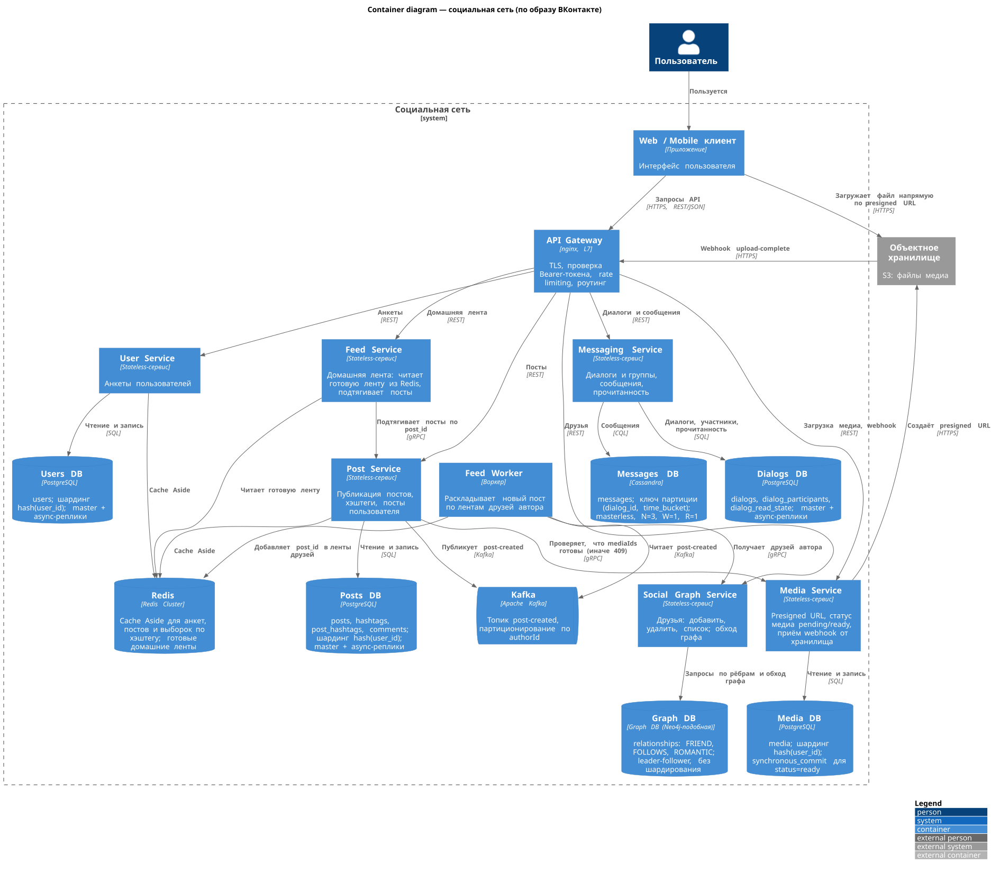

# Social Network System Design

Учебный проект: дизайн системы социальной сети (по образу ВКонтакте)
в рамках курса [System Design](https://balun.courses/courses/system_design).

## Содержание

- [`api/rest_api.yml`](./api/rest_api.yml) — REST API
- [`database/schema.dbml`](./database/schema.dbml) - Схема баз данных + репликация и шардирование
- [`database/schema.png`](./database/schema.png) - Схема в картинке
- [`images/diagrams/`] - Диаграммы

### Функциональные требования
- Просмотр анкеты пользователя
- Добавление и удаление друзей, просмотр списка друзей
- Публикация поста с медиа
- Загрузка медиафайлов для постов
- Просмотр домашней ленты и постов конкретного пользователя
- Создание диалога или группового чата, просмотр списка диалогов
- Отправка и чтение сообщений, отметка сообщений прочитанными

### Нефункциональные требования
- 47 000 000 DAU
- Время работы сервиса - 5 лет
- 10% DAU публикуют по 1 посту в день
- 50% DAU пользуются перепиской, в среднем 20 сообщений в день
- Каждый пользователь открывает ленту в среднем 20 раз в день
- 50% постов содержат фото(~3МБ), 5% - видео(~20МБ)
- Низкая задержка чтения: p99 < 500мс
- Доступность 99,95%; приоритет - доступность чтения и сообщений
- Опубликованный пост не должен теряться
- Текст поста и сообщения до 4000 символов, размер страницы до 100 элементов, до 5000 друзей на пользователя, фото до 10МБ, видео до 200МБ, не более 100 запросов в минуту на пользователя
- Геораспределение не требуется, сезонности нет

## Верхнеуровневый дизайн
Для проектирования использована C4 model.

Уровень 1. System Context



Уровень 2. Containers



## Расчёты

### RPS на создание постов:
```text
DAU = 47 000 000
Пишут посты: 10% DAU, по 1 посту в день
Постов в день = 4 700 000
RPS = 4 700 000 / 86 400 ~= 55
```

### RPS на чтение ленты:
```text
Каждый пользователь открывает ленту 20 раз в день
Чтений в день = 47 000 000 * 20 = 940 000 000
RPS = 940 000 000 / 86 400 ~= 11 000
Read:write = 940 000 000 / 4 700 000 = 200:1
```

### Входящий трафик на создание постов:
```text
Размер поста (текст + метаданные) ~= 2 000 Б
Трафик на API (текст) = 55 * 2 000 Б ~= 110 КБ/с

Фото: 4 700 000 * 50% * 3 МБ ~= 7 ТБ/день ~= 82 МБ/с
Видео: 4 700 000 * 5% * 20 МБ ~= 4,7 ТБ/день ~= 54 МБ/с
Трафик медиа ~= 136 МБ/с ~= 1,1 Гбит/с
```

### RPS на отправку сообщений:
```text
Пишут сообщения: 50% DAU = 23 500 000 человек, по 20 сообщений в день
Сообщений в день = 470 000 000
RPS (отправка сообщений) = 470 000 000 / 86 400 ~= 5 400
```

### Размер базы сообщений за 5 лет:
```text
Размер сообщения ~= 100 Б
Объём в день = 470 000 000 * 100 Б = 47 ГБ
За год = 47 ГБ * 365 ~= 17 ТБ
За 5 лет ~= 86 ТБ
```

### Диски для текстовых данных:
```text
Посты за 5 лет = 4 700 000 * 2 000 Б * 365 * 5 ~= 17 ТБ
Сообщения за 5 лет ~= 86 ТБ
Общий объём ~= 103 ТБ
Реплик = 3, итого ~= 309 ТБ
Диск 44 ТБ
Дисков = 309 / 44 ~= 8
```

### Диски для медиа:
```text
Фото за 5 лет = 7,05 ТБ * 365 * 5 ~= 12,9 ПБ
Видео за 5 лет = 4,7 ТБ * 365 * 5 ~= 8,6 ПБ
Общий объём ~= 21,4 ПБ
С 3 репликами ~= 64,4 ПБ, дисков = 64 350 / 44 ~= 1 463
```